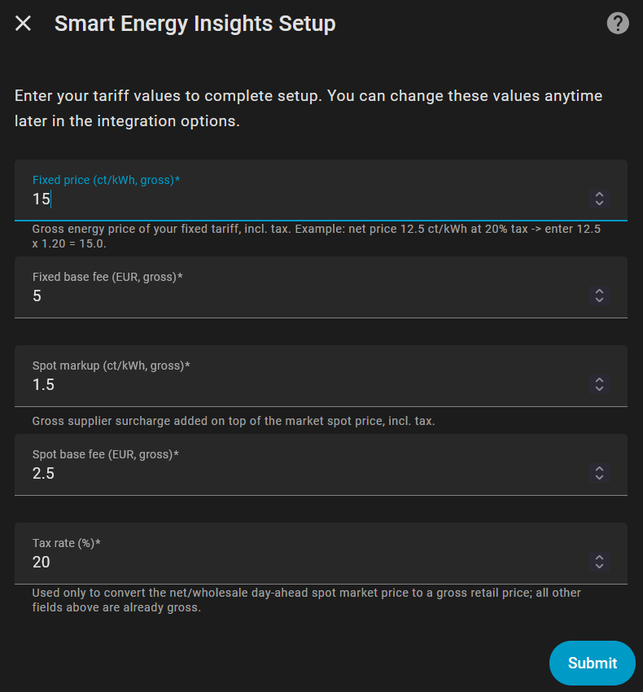
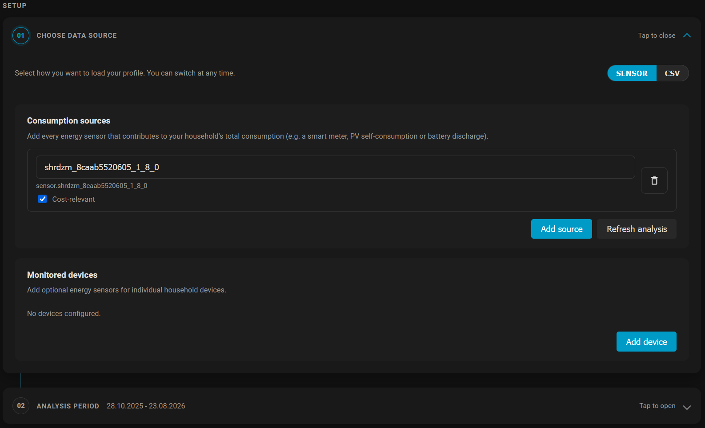
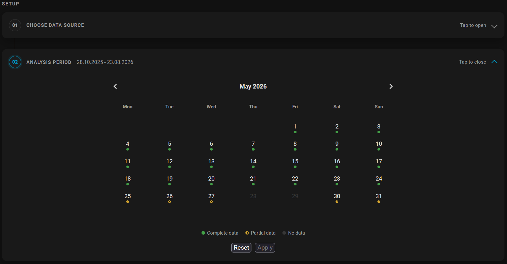
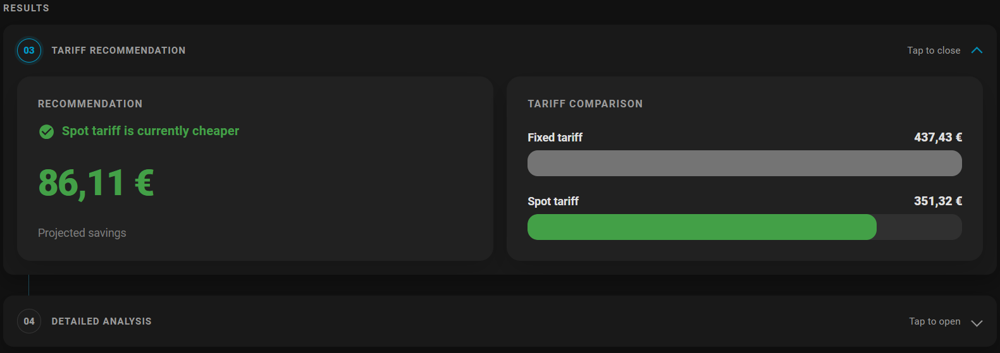
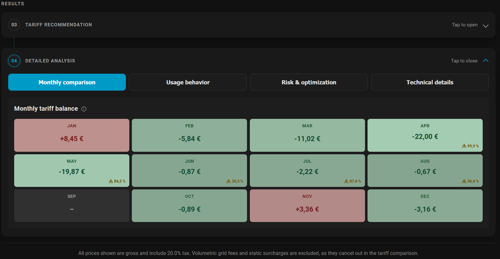
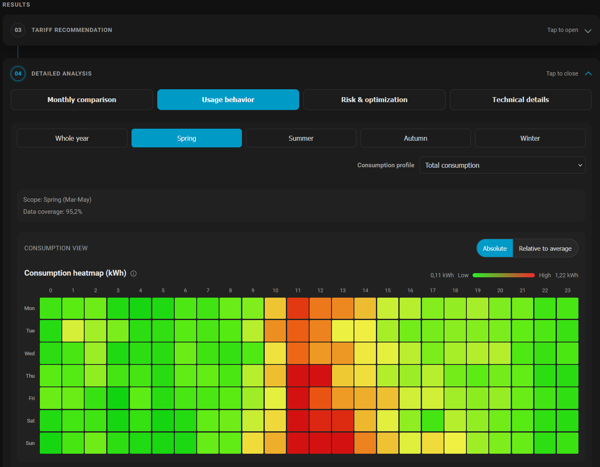
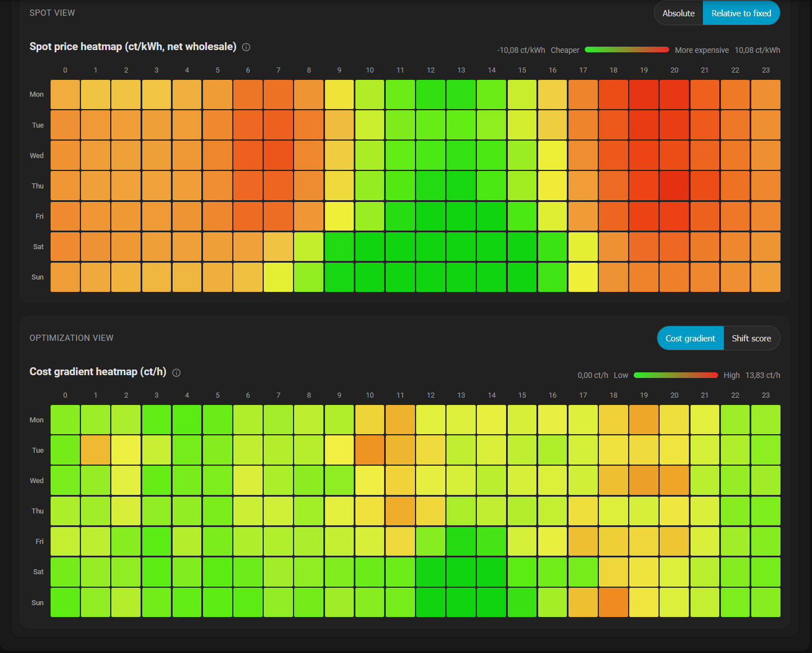
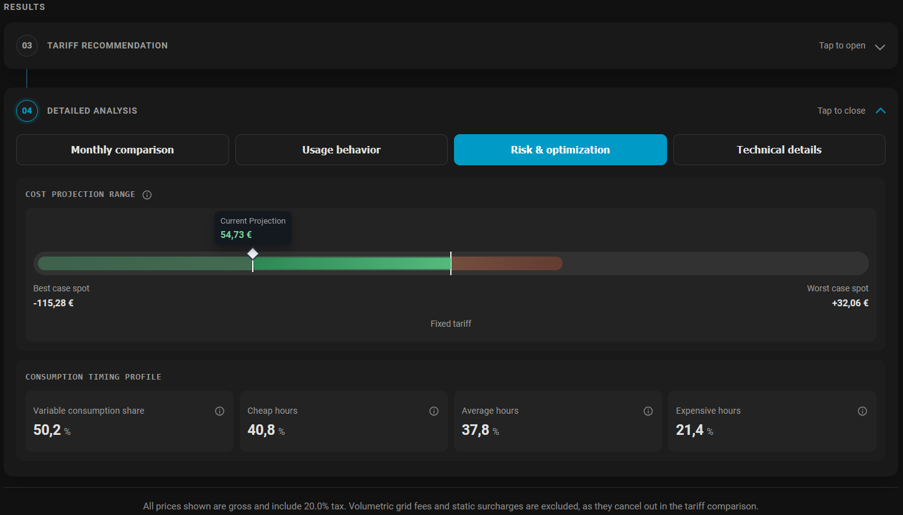
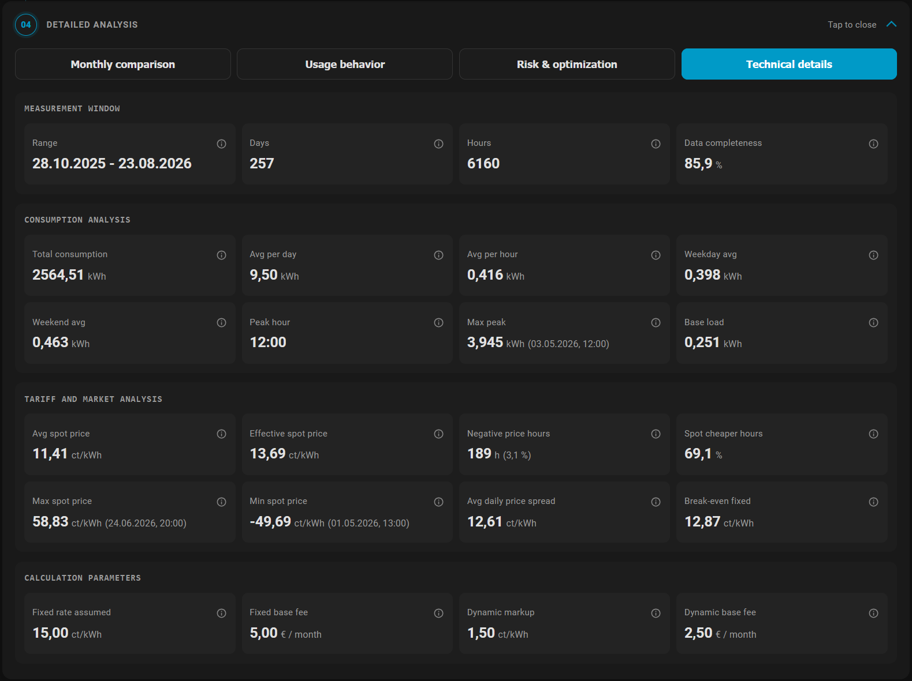

# Smart Energy Insights

[](https://github.com/hacs/integration)
[](https://www.home-assistant.io/)

Smart Energy Insights uses your own historical electricity consumption to answer a practical question: **Would a fixed tariff or an dynamic spot tariff have been cheaper for my household?**

The integration runs locally in Home Assistant. It combines your consumption profile with historical aWATTar day-ahead prices and presents the result in a dedicated sidebar dashboard. No external account or cloud service is required for your consumption data.

## What you get

- A direct comparison of fixed and dynamic tariff costs for a selectable period
- Consumption data from Home Assistant energy sensors or a CSV load profile
- Multiple consumption sources, with separate control over which sources affect tariff costs
- Monthly results and warnings for incomplete data
- Seasonal heatmaps for consumption, spot prices, and load-shifting opportunities
- A theoretical best/worst-case range for shifting flexible consumption
- Optional appliance-level heatmaps using additional energy sensors
- Automatic registration of the sidebar panel and Lovelace resource
- English and German UI, following your Home Assistant language

> [!IMPORTANT]
> The recommendation is a retrospective model based on the selected data, tariff settings, and historical spot prices. It is not a price forecast or a guarantee of future savings. Volumetric grid fees and other identical surcharges are excluded because they do not change the comparison.

## Requirements

- Home Assistant **2026.3.0** or newer
- The `recorder` integration and long-term statistics
- Internet access for market data from the [aWATTar API](https://api.awattar.at/)
- For sensor-based analysis: at least one compatible cumulative energy sensor with historical statistics

A compatible sensor has:

- device class `energy`
- state class `total` or `total_increasing`
- unit `kWh` or `Wh`

## Installation with HACS

1. Open **HACS** in Home Assistant.
2. Select **Integrations**.
3. Open the three-dot menu and choose **Custom repositories**.
4. Add `https://github.com/CS4FH/ha-smart-energy-insights` with category **Integration**.
5. Install **Smart Energy Insights** and restart Home Assistant.
6. Go to **Settings > Devices & services > Add integration**.
7. Search for **Smart Energy Insights** and complete the setup.

After setup, **Smart Energy Insights** appears in the sidebar. The dashboard and its frontend resource are created automatically.

## Configure your tariffs

The setup dialog asks for the values used in the comparison. You can change them later under **Settings > Devices & services > Smart Energy Insights > Configure**.



| Setting | Enter this value | Default |
|---|---|---:|
| Fixed price | Gross energy price of the fixed tariff | 15.0 ct/kWh |
| Fixed base fee | Gross monthly base fee of the fixed tariff | EUR 5.00 |
| Spot markup | Gross supplier markup added to the spot price | 1.5 ct/kWh |
| Spot base fee | Gross monthly base fee of the dynamic tariff | EUR 2.50 |
| Tax rate | Tax applied to the net wholesale spot price | 20% |

The fixed price, both base fees, and spot markup must be entered **including tax**. The tax rate is applied only when converting the net wholesale spot price to a gross retail price.

If your tariff sheet shows a net fixed price, convert it first. For example, `12.5 ct/kWh x 1.20 = 15.0 ct/kWh` gross at 20% tax.

## Use the dashboard

Open **Smart Energy Insights** in the Home Assistant sidebar. The dashboard guides you through four steps.

### 1. Choose a data source

You can switch between **Sensor** and **CSV** at any time. Previously imported data remains available when you switch.



#### Sensor

Use this option if Home Assistant already records your energy consumption. The initial analysis reads up to the latest 12 months of long-term statistics.

Under **Consumption sources**, add every sensor that contributes to the household total:

- Enable **Cost-relevant** for energy you pay your supplier for, typically grid import. Only these sources are used in the tariff comparison.
- Disable **Cost-relevant** for sources that should appear in total consumption but are not billed under the compared tariff, such as PV self-consumption or battery discharge.
- Do not add gross PV production or battery charging as household consumption.

Multiple sources are added together hour by hour. Use **Refresh analysis** after changing a source or when new statistics should be included.

Under **Monitored devices**, you can optionally add appliance sensors, for example a heat pump, boiler, or EV charger. These sensors provide separate usage heatmaps; they are not added to household consumption and do not change the tariff recommendation.

#### CSV

The CSV importer is primarily a legacy tool that was used while developing and debugging the integration. Prefer the **Sensor** source for normal use. If you already have a compatible or converted load-profile file, select or drag it into the upload area. See [CSV format](#csv-format) for the accepted structure and limitations.

### 2. Select the analysis period

The calendar shows which days have complete, partial, or no hourly data. Select a continuous period and apply it, or reset the selection to use the entire available range.



Prefer a period with high data completeness. Missing consumption or spot-price hours can make the comparison less representative; the dashboard warns when coverage is low.

### 3. Read the tariff recommendation

The recommendation compares total fixed-tariff cost with total dynamic-tariff cost for the selected period. A positive saving means the dynamic tariff was cheaper; an extra-cost result means the fixed tariff was cheaper.



The calculation includes the configured energy prices, supplier markup, tax, and prorated monthly base fees. It uses only consumption sources marked **Cost-relevant**.

### 4. Explore the details

#### Monthly comparison

See the difference between dynamic and fixed costs by month. Green values indicate savings with the dynamic tariff; red values indicate extra cost. Coverage warnings identify incomplete months.



#### Usage behavior

Compare average consumption by weekday and hour, filter by season, and switch between total consumption and configured appliance profiles.



The spot view can show net wholesale prices in absolute terms or relative to your fixed tariff. The optimization view combines price and consumption patterns to highlight costly hours and possible target hours for load shifting.



Heatmaps describe historical patterns. A favorable target hour does not mean that every appliance can technically or safely be shifted there.

#### Risk and optimization

The cost projection shows theoretical best and worst cases if flexible, cost-relevant consumption were moved to cheaper or more expensive hours. The timing profile shows how much consumption currently falls into each day's six cheapest, average, and six most expensive hours.



The variable consumption share is an estimate above the detected nightly base load. Treat it as an upper bound, not as the amount that can necessarily be shifted in practice.

#### Technical details

Use this tab to verify the measurement window, completeness, consumption totals, market statistics, break-even price, and tariff parameters behind the recommendation.



## CSV format

> [!NOTE]
> The importer is tailored to a specific load-profile format based on exports from **Energienetze Steiermark** and is therefore only of limited use with files from other providers. It is not exactly plug and play: getting data into the required shape may involve some spreadsheet cleanup or a small Python conversion detour.
>
> In the original development workflow, even obtaining a complete year was not available through the provider's usual download interface. It required adjusting the API request in the Firefox developer console; the response then arrived Base64-encoded and still had to be decoded and converted. That worked well enough for debugging, but it is not intended or recommended as a regular user workflow. Most providers do not appear to offer a convenient full-year export in this format, so consider CSV an experimental escape hatch rather than the main entrance.

The importer expects a semicolon-separated file. Only the four columns below are required; additional columns from a supplier export are ignored.

| Required column | Format | Example |
|---|---|---|
| `Statistikzeitraum Beginn` | `DD.MM.YYYY HH:MM` | `01.01.2025 00:00` |
| `Statistikzeitraum Ende` | `DD.MM.YYYY HH:MM` | `01.01.2025 00:15` |
| `Wert` | Consumption during the interval | `0,135` |
| `Einheit` | `kWh` | `kWh` |

Example:

```csv
Statistikzeitraum Beginn;Statistikzeitraum Ende;Wert;Einheit
01.01.2025 00:00;01.01.2025 00:15;0,135;kWh
01.01.2025 00:15;01.01.2025 00:30;0,112;kWh
```

CSV rules:

- Maximum file size: **50 MB**
- Timestamps are interpreted in the Home Assistant local timezone
- Decimal comma and decimal point are accepted
- Unit matching is case-insensitive, but only `kWh` is supported
- Typical 15-minute meter values are summed into hourly consumption for analysis
- UTF-8 and common Western European encodings are supported

Uploaded profiles are stored as Home Assistant long-term statistics and can be inspected under **Developer tools > Statistics**. The generated **Spot Price (statistics only, no live state)** entity is also a statistics carrier; it is not a sensor for displaying the current price on a dashboard.

## Data and calculation notes

- Consumption data stays in your Home Assistant instance.
- Spot prices are fetched and stored as long-term statistics.
- Dynamic energy price = net wholesale spot price + configured tax + gross supplier markup.
- Base fees are prorated to the matched analysis duration.
- Only hours with matching consumption and spot-price data contribute to tariff costs.
- Results become less reliable when the selected period is short, seasonal coverage is uneven, or data completeness is low.

## Troubleshooting

**No sensor appears in the picker**

Check the sensor's device class, state class, unit, and long-term statistics under **Developer tools > Statistics**. A power sensor in `W` or `kW` is not an energy sensor and cannot be used directly.

**The selected period contains no result**

Choose days marked as complete or partial in the calendar. Sensor history is limited by your recorder retention and available long-term statistics; the default sensor import covers the latest 12 months.

**The dashboard or sidebar entry is missing after installation**

Restart Home Assistant, confirm that the integration is loaded under **Settings > Devices & services**, and refresh the browser without using its cached frontend files.

**The comparison differs from my electricity bill**

Verify that all tariff values are gross and that only grid-billed consumption sources are marked **Cost-relevant**. The comparison does not reproduce the entire bill: volumetric grid fees and identical static charges are intentionally excluded.

## Project background

Smart Energy Insights is developed as part of a Master's thesis in the Software and Digital Experience Engineering program at FH JOANNEUM. It was created by Christoph Seidlinger and supervised by [FH-Prof. DI Dr. Alexander Nischelwitzer](https://www.fh-joanneum.at/hochschule/person/alexander-nischelwitzer/).