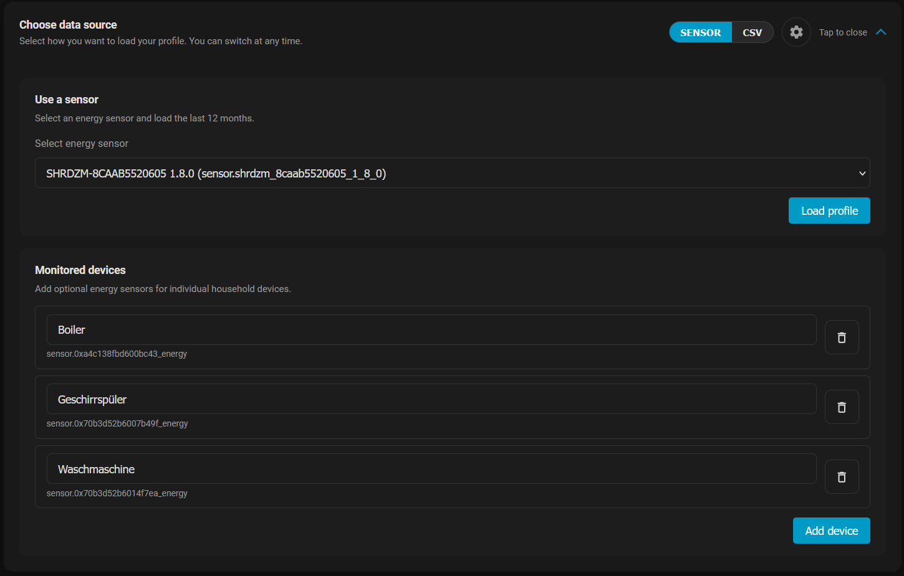
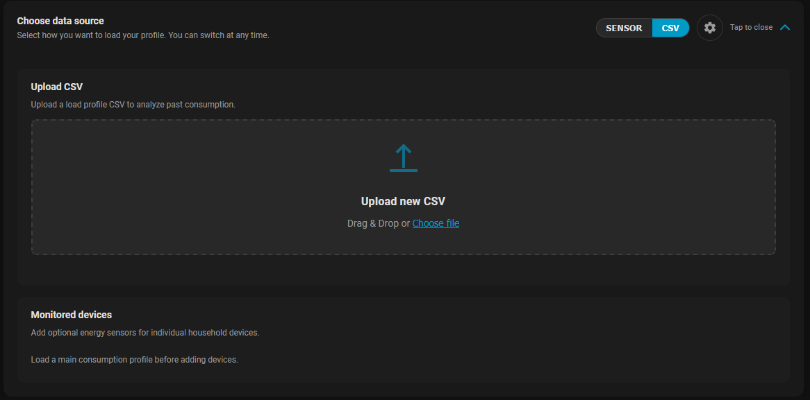
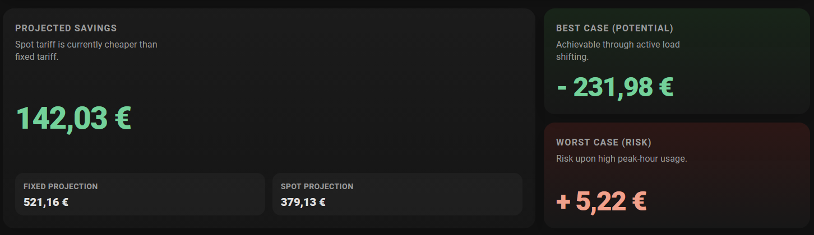
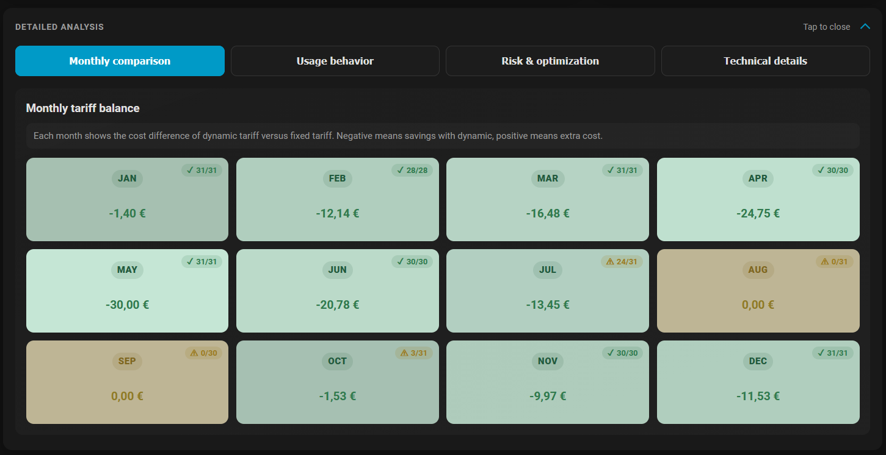
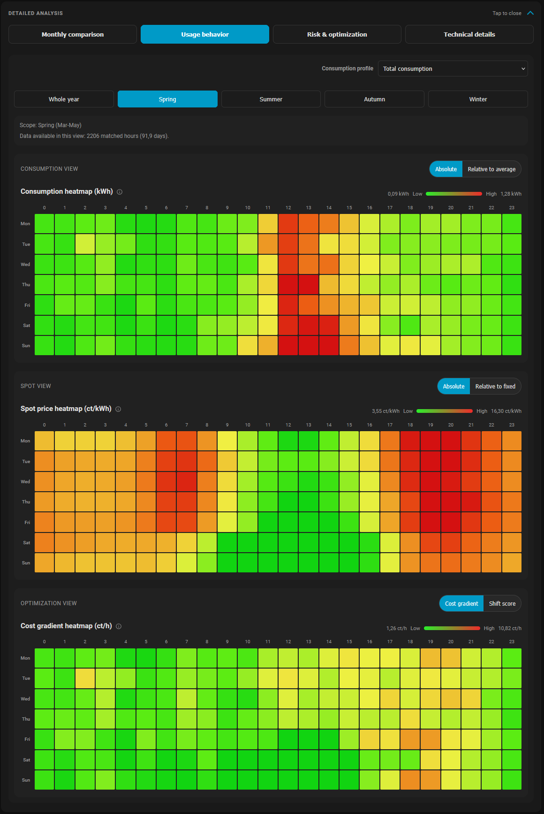
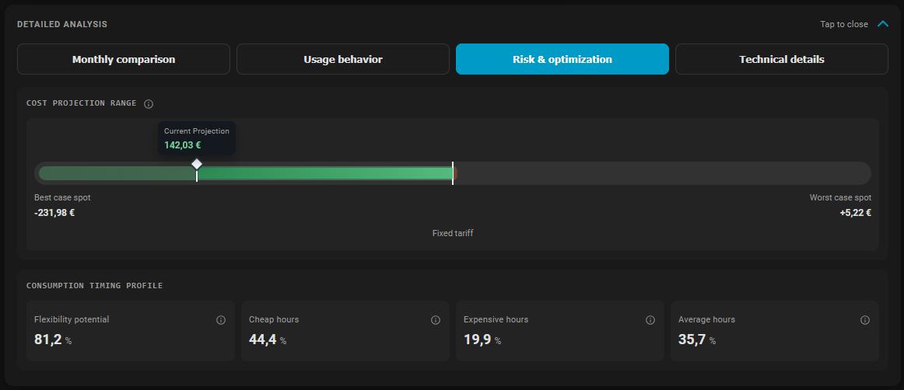
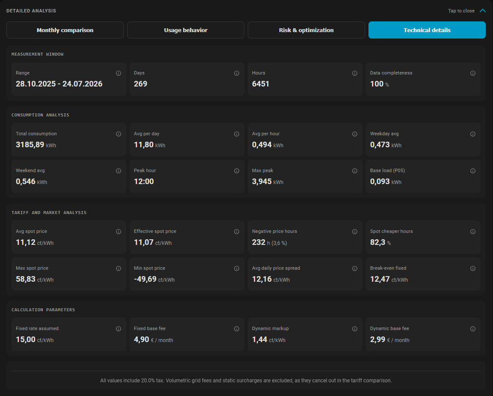

# Smart Energy Insights

[](https://github.com/hacs/integration)

A Home Assistant integration that helps households decide between a **fixed** and a **dynamic (day-ahead spot) electricity tariff**, based on their own historical consumption data — either uploaded as a CSV load profile or loaded directly from an existing Home Assistant energy sensor.

## 📌 Project Overview
Smart Energy Insights is being developed as part of an ongoing Master's Thesis at FH JOANNEUM. It is implemented as a local Home Assistant integration with its own sidebar panel, custom Lovelace card, and analysis dashboard — no cloud services or external accounts required.

## 🛠 Features
* **Data import:** Load historical consumption either by uploading a 15-minute CSV load profile, or by selecting an existing Home Assistant energy sensor (imports up to the last 12 months of long-term statistics).
* **Day-ahead spot prices:** Automatically fetches and stores Austrian EPEX day-ahead spot prices (via the aWATTar API) as long-term statistics and exposes them as a sensor entity.
* **Tariff comparison:** Compares your real consumption against a configurable fixed tariff and a configurable dynamic/spot tariff (markup, base fees, tax rate), and projects potential savings or additional cost.
* **Analysis dashboard:** A dedicated sidebar panel with a multi-tab dashboard — monthly comparison, usage behavior, risk & optimization, and technical details.
* **Seasonal heatmaps:** Consumption and price visualized by hour-of-day and weekday, split by season.
* **Monitored devices:** Attach additional per-device energy sensors to break down consumption and cost by individual appliance.
* **No manual dashboard setup:** The custom card resource and sidebar panel are registered automatically when the integration is set up.

## 🚀 Installation
1. Open **HACS** in Home Assistant.
2. Navigate to **Integrations** -> **Custom repositories** (three-dot menu).
3. Add this repository URL and select `Integration` as the category.
4. Click **Install** and restart Home Assistant.
5. Go to **Settings → Devices & Services → Add Integration** and search for **Smart Energy Insights**.

After adding the integration, a **Smart Energy Insights** entry appears in the sidebar, and a `Spot Price` sensor entity is created that tracks the current day-ahead spot price.

## ⚙️ Configuration
The initial setup requires no input. Tariff parameters can be adjusted afterwards via the integration's **Options** (Settings → Devices & Services → Smart Energy Insights → Configure):

| Option | Description | Default |
|---|---|---|
| Fixed price | Fixed tariff energy price, **gross** (tax-included) | 15.0 ct/kWh |
| Fixed base fee | Fixed tariff monthly base fee, **gross** | 4.90 € |
| Spot markup | Supplier markup added on top of the spot price, **gross** | 1.5 ct/kWh |
| Spot base fee | Dynamic tariff monthly base fee, **gross** | 5.99 € |
| Tax rate | Used only to convert the net/wholesale day-ahead spot market price into a gross retail price; not applied to the fields above, which are already gross | 20 % |

All prices are entered gross (tax-included), matching what's shown on a typical utility bill or tariff sheet. If you only know your net price (excl. tax), convert it first: `gross = net × (1 + tax rate / 100)` — e.g. a net price of 12.5 ct/kWh at 20% tax becomes `12.5 × 1.20 = 15.0` ct/kWh gross.

## 📊 Using the Dashboard

Open **Smart Energy Insights** in the sidebar to access the analysis panel.

### 1. Choose a data source

Pick how you want to load your consumption data — either from an existing energy sensor or from a CSV file. You can switch between them at any time.

**Sensor:** Select an energy sensor to import the last 12 months of statistics, and optionally attach **monitored devices** (additional sensors for individual appliances such as a boiler, dishwasher, or washing machine) to later see a per-device breakdown.



**CSV:** Drag & drop or select a CSV load profile file to upload instead.



### 2. Review the savings summary

Once a profile is loaded, the hero cards at the top summarize the tariff comparison at a glance: the projected savings (or extra cost) of the dynamic tariff versus the fixed tariff, along with a best-case (with active load shifting) and worst-case (peak-hour heavy usage) projection.



### 3. Detailed analysis tabs

Below the summary, a **Detailed analysis** panel with four tabs breaks the data down further:

**Monthly comparison** — the cost difference between the dynamic and fixed tariff for each month, including data completeness per month.



**Usage behavior** — heatmaps of consumption, spot price, and cost gradient by hour-of-day and weekday, filterable by season, to spot when you consume the most and when energy is cheapest.



**Risk & optimization** — the cost projection range between best and worst case, plus your consumption timing profile (flexibility potential, share of cheap/expensive/average hours).



**Technical details** — the underlying figures: measurement window, consumption statistics, spot market analysis, and the tariff parameters used for the calculation.



### CSV File Format

The integration supports importing historical load profiles from CSV files with the following format:

| Column Name | Format | Example |
|---|---|---|
| `Anlagennummer` | String | 1234567890 |
| `Zählpunkt` | String | AT001230045670000000000000012345678 |
| `Tarif` | String | (optional) |
| `Statistikzeitraum Beginn` | `DD.MM.YYYY HH:MM` | 01.01.2025 00:00 |
| `Statistikzeitraum Ende` | `DD.MM.YYYY HH:MM` | 01.01.2025 00:15 |
| `Wert` | Number (comma as decimal) | 0,135 |
| `Einheit` | String | kWh |
| `Messart` | String (optional) | VAL |

**Requirements:**
* Delimiter: **Semicolon** (`;`)
* Time intervals: **15 minutes** exactly
* Unit: **kWh** (case-insensitive)
* Timestamps: **Local timezone** (converted to UTC on import)
* Numeric values: Comma (`,`) as decimal separator
* Max file size: 50 MB

### Imported Statistics

Imported load profiles are stored as Home Assistant Long-Term Statistics and can be inspected in **Developer Tools → Statistics**, alongside the standard `Spot Price` sensor.

## 🏗 Requirements
* Home Assistant **2024.1.0** or newer.
* The `recorder` integration (enabled by default via `default_config` in a standard Home Assistant setup) for long-term statistics.
* An internet connection to fetch day-ahead spot prices from the aWATTar API (Austrian market).

## 🧪 Development
Tests live in [tests/](tests) and run with `pytest` (see [pytest.ini](pytest.ini) and [requirements-dev.txt](requirements-dev.txt)):

```bash
pytest
```

---
*Created by Christoph Seidlinger as part of the Master's Program Software and Digital Experience Engineering at FH JOANNEUM, supervised by [FH-Prof. DI Dr. Alexander Nischelwitzer](https://www.fh-joanneum.at/hochschule/person/alexander-nischelwitzer/).*